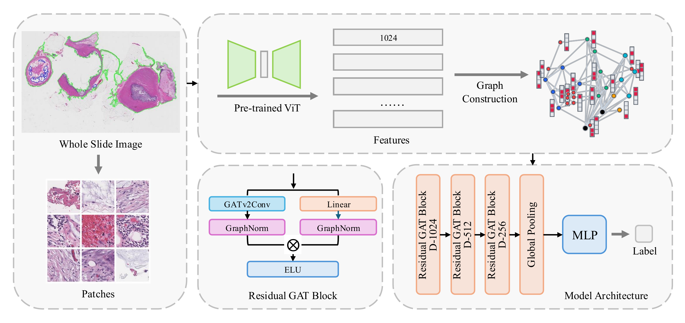

# ResGAT: A Residual Graph Attention Network for Cancer Subtype Classification in Whole Slide Images

[](https://midl.io)

> **Paper accepted at MIDL 2026 (Medical Imaging with Deep Learning).**

---

## Overview

ResGAT uses GATv2-based residual blocks with GraphNorm to classify cancer subtypes from WSI-derived tissue graphs. Graphs are constructed via a hybrid spatial-feature kNN scheme that intersects coordinate proximity with feature cosine similarity.



---

## Repository Structure

```
ResGAT/
├── README.md
├── requirements.txt
├── heatmap_visualization.ipynb           # GradCAM++ interpretability notebook
├── run.py                                # Unified training script (all datasets)
├── assets/
├── models/
│   ├── resgat.py                         # Core ResGAT model
│   └── weights/                          # Saved checkpoints (default --save_dir)
├── graph_construction/
│   ├── build_graphs.py                   # Hybrid spatial-feature kNN
│   └── graphs/                           # Built graph .pt files (default --output_dir)
├── utils/
│   ├── metrics.py                        # Evaluation helpers
│   └── losses.py                         # Focal, LDAM, CB-CE, logit adjustment
├── ablation_study/
│   ├── models/
│   │   ├── resgat_ablations.py           # Conv-type / layer-number / norm-type variants
│   │   └── resgat_no_residual.py         # Ablated model without residual connections
│   ├── run_layer_type_ablation.py
│   ├── run_layer_number_ablation.py
│   ├── run_normalization_ablation.py
│   └── run_structure_ablation.py
└── domain_adaptation/
    └── run_cross_site.py                 # 3-phase cross-site domain adaptation
```

---

## Installation

```bash
git clone https://github.com/MaizieZhou-lab/ResGAT.git
cd ResGAT
pip install -r requirements.txt
```

**Note:** PyTorch Geometric requires matching CUDA/PyTorch versions. See the [PyG installation guide](https://pytorch-geometric.readthedocs.io/en/latest/install/installation.html) for details.

---

## Data Preparation

### 1. Extract patch features

Use [CLAM](https://github.com/mahmoodlab/CLAM) to extract patch-level features (`.pt`) and coordinates (`.h5`) from WSIs.

### 2. Build graphs

```bash
python graph_construction/build_graphs.py \
    --input_dir /path/to/pt_features/ \
    --h5_dir /path/to/h5_files/ \
    --label_csv /path/to/labels.csv \
    --output_dir graph_construction/graphs/ \
    --f_neighbors 50 --d_neighbors 15 --final_k 6
```

The label CSV should have two columns: `filename` (matching `.pt` file stems) and `label` (integer class).

---

## Training

### AC (Appendiceal Cancer) — Binary Classification

```bash
python run.py \
    --dataset ac \
    --graph_dir graph_construction/graphs/ \
    --splits_pkl data/ac/AC_five_fold_splits.pkl \
    --epochs 20 --lr 3e-4 --device cuda:0
```

### TCGA-NSCLC — Binary Classification

```bash
python run.py \
    --dataset tcga_nsclc \
    --graph_dir data/tcga_nsclc/graphs/ \
    --splits_pkl data/tcga_nsclc/splits.pkl \
    --epochs 20 --lr 3e-4 --device cuda:0
```

### BRACS — 7-Class Classification

```bash
python run.py \
    --dataset bracs \
    --graph_dir data/bracs/graphs/ \
    --splits_pkl data/bracs/splits.pkl \
    --n_classes 7 --epochs 50 --lr 3e-4 --device cuda:0
```

Checkpoints are saved to `models/weights/` by default. Use `--wandb_mode online` to enable W&B logging.

---

## Ablation Studies

```bash
# Layer type: GATv2 vs GCN vs GIN vs GraphSAGE
python ablation_study/run_layer_type_ablation.py \
    --graph_dir data/graphs/ --splits_pkl data/splits.pkl

# Number of layers: 2 vs 3 vs 4
python ablation_study/run_layer_number_ablation.py \
    --graph_dir data/graphs/ --splits_pkl data/splits.pkl

# Normalization: GraphNorm vs BatchNorm vs LayerNorm vs InstanceNorm
python ablation_study/run_normalization_ablation.py \
    --graph_dir data/graphs/ --splits_pkl data/splits.pkl

# Structure: with vs without residual connections
python ablation_study/run_structure_ablation.py \
    --graph_dir data/graphs/ --splits_pkl data/splits.pkl
```

---

## Domain Adaptation

Three-phase protocol: source pre-training → zero-shot evaluation → few-shot fine-tuning.

```bash
python domain_adaptation/run_cross_site.py \
    --graph_dir data/ac/graphs/ \
    --source_prefix WF --target_prefix S \
    --few_shot_samples 3 6 9 \
    --source_epochs 20 --ft_epochs 20 \
    --freeze_strategy graphnorm_fc --device cuda:0
```

---

## Visualization

Open `heatmap_visualization.ipynb` to generate GradCAM++ heatmaps. The notebook produces:

- Original WSI with ROI contour overlay
- Aggregated heatmap from cross-validation folds
- Per-fold GradCAM++ heatmaps

---

## Citation

Paper accepted at MIDL 2026. Citation will be updated once the proceedings are published.
